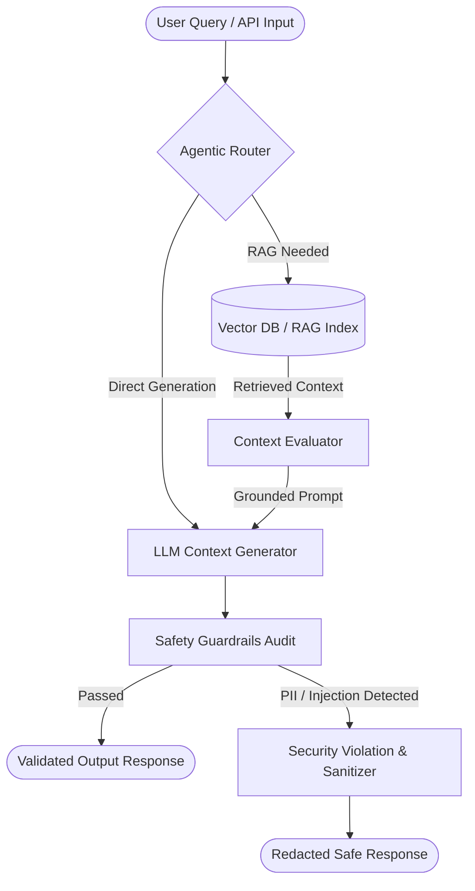

# System Architecture & Multi-Agent Routing Specification

This document details the architectural design of the **Agentic Routing Engine** and **Safety Guardrail Evaluation Pipeline**.

## 🏗️ High-Level Multi-Agent Architecture

---

## ⚡ Component Breakdown

### 1. Agentic Router (`agentic_routing/core.py`)
- Analyzes incoming natural language queries.
- Determines whether vector retrieval (RAG) is required before invoking LLM synthesis.
- Measures pipeline execution latency in milliseconds.

### 2. Context Evaluator (`agentic_routing/evaluator.py`)
- Computes ground-truth context relevance scores.
- Guards against LLM factual hallucinations by enforcing context document coverage thresholds.

### 3. Safety Guardrails (`agentic_routing/guardrails.py`)
- Audits generated output text for PII disclosure (API keys, SSNs, credentials).
- Intercepts prompt injection payloads before returning data to end users.

---

## 🔒 Security & OpenSSF Compliance
- Standardized vulnerability reporting policy (`SECURITY.md`).
- Automated CodeQL static analysis scans on every pull request.
- Contributor Covenant Code of Conduct (`.github/CODE_OF_CONDUCT.md`).
